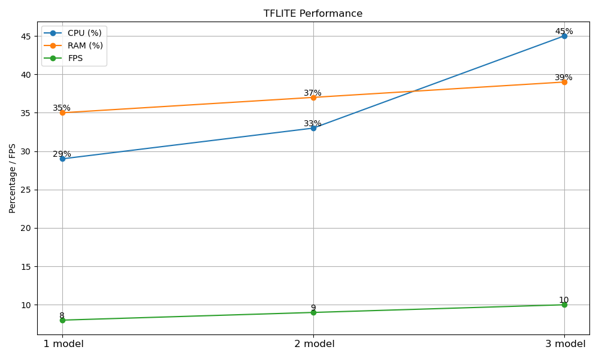

# Garbage Chute Edge Processing

Program to receive stream, process on the edge and publish relevant results to the backend as part of the Garbage Chute Prolonged Opening Detection pipeline

## Demo

Online demonstration can be found [here](http://cs2.sg:5000/garbagechute/)

## Getting Started

This program has been tested in a Linux environment with python 3.10

### Installation and Usage

1. Download dependencies from requirements.txt:

```
pip install -r requirements.txt
```

Note: tflite-runtime Python wheels are pre-built and provided only for Linux. For non-Linux environments, either install the full TensorFlow package and modify `chute/Detector/Detector.py` accordingly or build the tflite-runtime package from source

2. Run the command:

```
python main.py [optional, -c config] [optional, -s source]

eg. python main.py -c config.ini -s rtsp://0.0.0.0:0/stream
```

#### Multi-stream setup
1. Create the relevant config files for each stream (for organisation, keep them in a folder named `config`). Main changes to be made are:
    - `cam_id`: should be unique
    -  `cpu_cores`: should not be 0 when having multiple streams
    - `socket port`: should be unique
2. Edit `run.py` to create processes, each associated with one stream
3. Run the command:
```
python run.py
```

### Configuration

- Video source can be specified as a CLI argument or configured in `main.py` as an argument for the `run` method of the `Chute` object

- Other configurations can be made using the `config.ini` file. Alternatively, a copy of the `config.ini` file can be made and its path should be specified either as a CLI argument or in the initialisation of the `Chute` class in `main.py`

## How it works

The program pulls the stream from the stream source and processes it frame by frame. The processed frame is then sent via sockets to the server for a visualisation of the live stream.

The program uses the provided detection model to detect opened and closed garbage chutes.

When the garbage chute is detected to be open, a counter will start and after a (configurable) set amount of time, the prolonged opening of the garbage chute will be registered.

The video clip from the time when the garbage was first opened will be saved, and uploaded to the server via FTP. A message will also be sent to the MQTT broker.

Until the garbage chute is closed again, no more additional videos will be saved or uploaded to the server.

## Benchmarks


